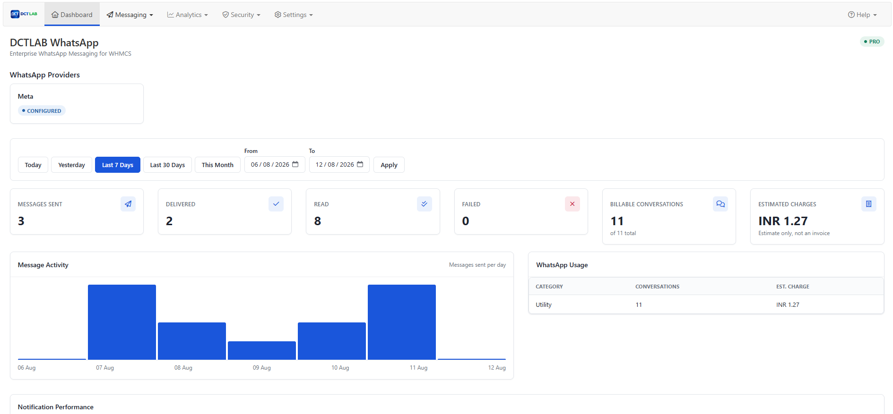
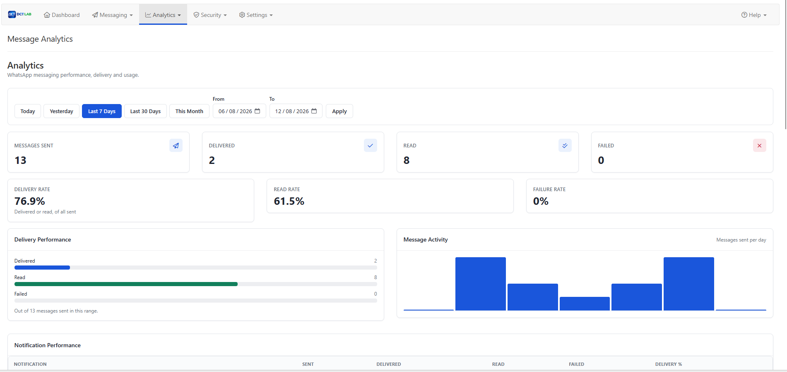
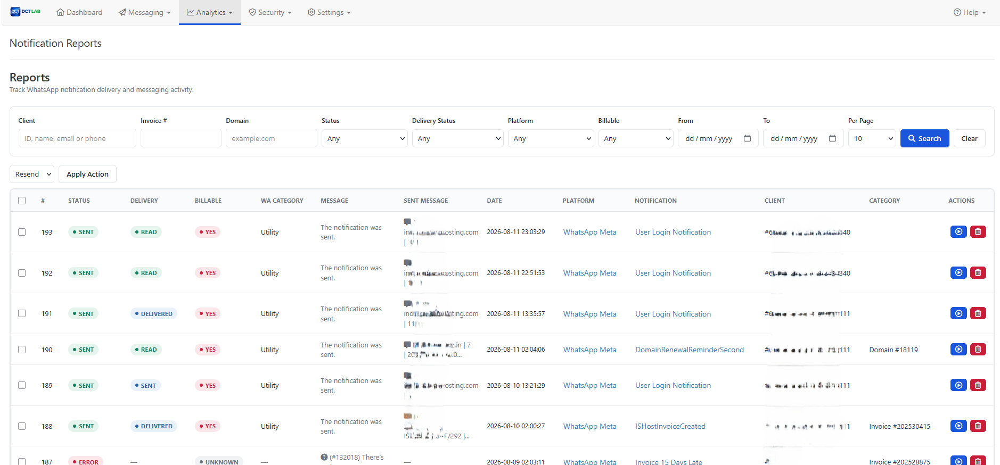
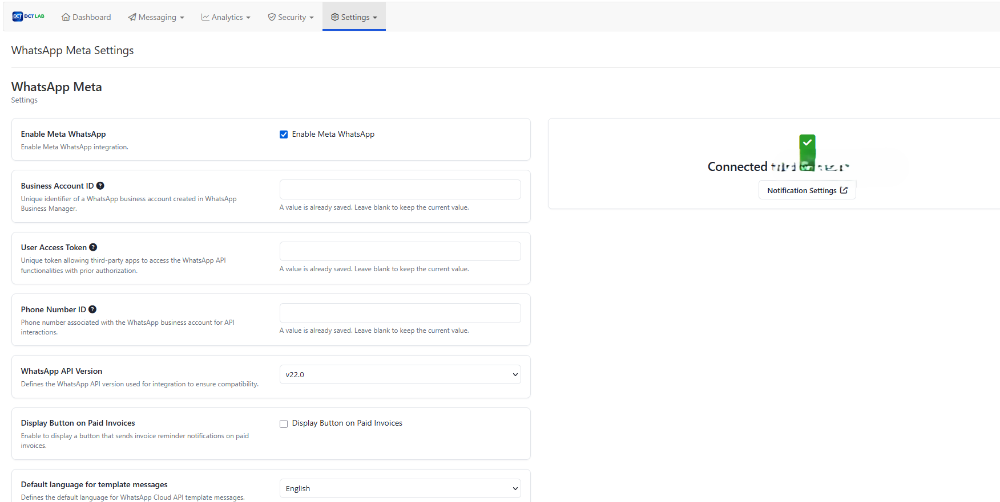
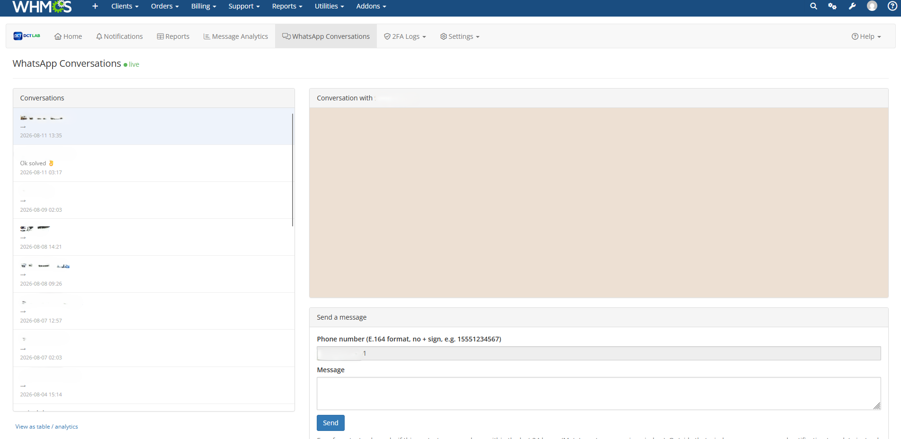
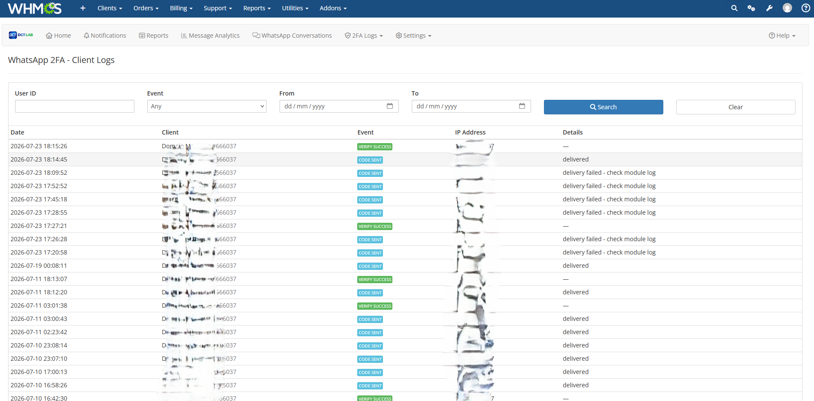

# 🚀 WHMCS WhatsApp Notifications
## Enterprise Open Source Edition (DCTLab)

> A modern, enterprise-grade WhatsApp notification platform for WHMCS with support for multiple providers, delivery tracking, reporting, webhooks, queue processing, analytics, and a developer-friendly architecture.


---

# 🎨 DCTLAB UI/UX Redesign & Security Hardening

The DCTLAB Enterprise Open Source Edition includes a comprehensive
administrative UI/UX modernization across the WhatsApp Notifications
module. The redesign improves navigation, visual consistency,
responsive behavior, accessibility, security, and administrator
workflows while preserving the existing backend architecture and
provider integrations.

## Redesign Scope

| Phase | Area | Status |
|------:|------|:-----:|
| 1 | Foundation, DCTLAB design system & navigation | ✅ |
| 2 | Dashboard | ✅ |
| 2P | Reporting performance & database index | ✅ |
| 3A | Notifications management | ✅ |
| 3B | WhatsApp template editor | ✅ |
| 4 | Reports | ✅ |
| 5 | Analytics | ✅ |
| 6 | Conversations | ✅ |
| 7 | 2FA security logs | ✅ |
| 8 | Provider & module settings | ✅ |
| 8S | Credential security hardening | ✅ |
| 9 | Bulk Messaging / campaign management | ✅ |
| 10 | Final security, QA & regression audit | ✅ |

## Design System

The new interface uses a namespaced DCTLAB design system so that
module styling does not leak into the surrounding WHMCS administration
interface.

Core reusable components include:

- `.dct-page-header`
- `.dct-card`
- `.dct-stat-card`
- `.dct-toolbar`
- `.dct-table`
- `.dct-form`
- `.dct-form-group`
- `.dct-form-label`
- `.dct-input`
- `.dct-select`
- `.dct-button`
- `.dct-status-badge`
- `.dct-alert`
- `.dct-empty-state`

All new CSS is scoped under:

```text
.dctlab-whatsapp
```

The module remains compatible with **Bootstrap 3.4**. No Bootstrap 5
migration was introduced and no second Bootstrap/jQuery version is
loaded.

## Navigation

The administration navigation was reorganized into logical groups:

```text
Messaging
├── Notifications
├── Templates
├── Conversations
└── Bulk Messaging

Analytics
├── Dashboard
├── Reports
└── Analytics

Security
└── 2FA Logs

Settings
└── Provider / Module Settings
```

The actual navigation is based on the module's existing route table and
backend capabilities. No fake or unsupported endpoints were introduced.

# 🖥️ Admin UI Screenshots

The following screenshots show the redesigned WHMCS administration
interface delivered across the DCTLAB WhatsApp Notifications module.

## Dashboard



The dashboard provides date-range controls, message KPIs, provider
configuration status, message activity, WhatsApp usage, and notification
performance.

## Message Analytics



The Analytics page provides delivery/read/failure metrics, delivery
performance, daily message activity, and notification performance.

## Notification Reports



The Reports interface provides server-side filters, delivery status,
billable status, platform information, notification details, pagination,
and report actions.

## WhatsApp Meta Settings



Provider settings use the DCTLAB card-based form design. Password-type
credentials are intentionally rendered empty while preserving the
stored value when the administrator leaves the field blank.

## WhatsApp Conversations



The Conversations interface provides the existing live conversation
list, message thread, message status, and send-message workflow with
responsive presentation.

## WhatsApp 2FA Client Logs



The 2FA Logs interface provides User ID, event, and date-range filters
with a structured audit-log table and event badges.

---

## Dashboard

The redesigned Dashboard uses the existing analytics infrastructure
and provides:

- Sent messages
- Delivered messages
- Read messages
- Failed messages
- Billable conversations
- Estimated charges
- Notification performance
- Recent activity
- Daily message activity
- Provider configuration status

Provider status deliberately reports **Configured / Not Configured**
rather than claiming a live **Connected** state when no connection check
is performed.

## Notifications

The Notifications interface was redesigned with:

- Search
- Status filtering
- Provider filtering
- Improved notification/template hierarchy
- Status badges
- Responsive tables
- Empty and no-results states
- Existing template creation/edit/delete actions

The underlying notification routes, form fields, license restrictions,
and template operations remain unchanged.

## Template Editor

The template editor was modernized without changing its backend form
architecture.

Supported existing behavior includes:

- Language selection
- Platform selection
- Meta approved-template selection
- Meta `{{N}}` variable mapping
- Standard provider parameter insertion
- Existing validation and save behavior
- Client-side WhatsApp-style message preview

The preview uses only data already rendered on the page.

## Reports

The Reports interface retains the existing server-side architecture:

- Client filtering
- Invoice filtering
- Domain filtering
- Status filtering
- Delivery-status filtering
- Platform filtering
- Billable filtering
- Server-side pagination
- Bulk actions
- Resend
- Delete
- Message details
- Empty states

The redesign adds consistent DCTLAB table, toolbar, badge, and empty
state presentation without replacing the underlying repository queries.

## Analytics

Analytics now provides a more complete visual overview:

- Delivery rate
- Read rate
- Failure rate
- Delivery counts
- Conversation/billing analytics
- Approximate charges
- Date presets
- Date-range-aware notification performance
- Daily message activity

Existing analytics calculations remain authoritative.

Lightweight CSS-based visualizations avoid unnecessary chart-library
dependencies, and charts include accessible text alternatives.

## Conversations

The live WhatsApp conversation interface was redesigned while
preserving:

- Conversation list
- Message thread
- Incoming/outgoing message bubbles
- Outbound delivery status
- Free-form messaging within the existing Meta 24-hour window
- Existing 5-second polling
- Responsive mobile navigation

Existing server-side and client-side message escaping was preserved.

No new media, attachment, reaction, or template-sending capability was
invented.

## 2FA Security Logs

The 2FA log interface uses the existing `dct2fa` log data and supports:

- Client logs
- Admin logs
- User ID filtering
- Event filtering
- Date filtering
- Server-side pagination

A security audit identified missing output escaping in the original
template. IP addresses, details, usernames, and event fallback values
are now escaped at output time.

OTP values, credentials, and tokens are not displayed.

## Settings

Settings use the module's existing data-driven provider architecture.

Confirmed platform configuration includes:

- Meta
- Evolution API
- Baileys
- Botms
- Chatwoot
- General module settings
- Bulk Messaging settings

The generic settings UI supports the existing:

- Text
- Password
- Select
- Multiple select
- Textarea
- Checkbox
- Separator

### Credential Security Hardening

A significant pre-existing security issue was identified and fixed.

Previously, stored credentials were rendered directly into HTML:

```html
<input type="password" value="ACTUAL_SECRET">
```

Changing the input type to `password` only hid the value visually; the
credential remained accessible through View Source and browser developer
tools.

The corrected behavior is:

```html
<input type="password" value="">
```

with the existing credential retained server-side when the field is
left blank.

The save path identifies password fields from the server-side provider
settings definition rather than trusting browser input.

Credential logging was also hardened using WHMCS's existing masking
mechanism.

## Bulk Messaging

Bulk Messaging is an existing campaign-management system rather than a
simple synchronous send form.

The redesigned interface preserves:

- Campaign list
- Campaign creation
- Campaign editing
- Client-status filtering
- Language filtering
- Country filtering
- Service filtering
- Service-status filtering
- Matched-client preview
- Per-client recipient exclusion
- Provider selection
- Existing template editor integration
- Max concurrency
- Campaign status
- Per-recipient resend
- Cron-based processing

Bulk Messaging remains **cron-driven**. Messages are not sent
synchronously from the browser.

A real bug in the existing Max Concurrency display was also fixed: an
invalid Smarty condition caused edited campaigns to display `0` instead
of their saved concurrency value.

## Performance

A reporting performance audit found that the report table lacked a
supporting index for the new dashboard/reporting access patterns.

The final migration adds:

```sql
INDEX idx_created_at_status (created_at, status)
```

to:

```text
mod_dct_hook_notification_reports
```

The migration is idempotent and checks:

1. Table existence
2. `information_schema.STATISTICS`
3. Existing index name

No destructive schema changes were introduced.

## Security Hardening

The final audit covered:

- Credential exposure
- XSS/output escaping
- JavaScript interpolation
- CSRF preservation
- Authorization
- License restrictions
- Provider error handling
- Logging
- Route validation
- 2FA output
- Conversation message rendering
- Bulk Messaging safety

Three additional issues were discovered during the final audit and fixed:

### Evolution API — Medium

Raw third-party API error responses were displayed directly in the
administrator interface.

**Status: Fixed**

### Chatwoot — Medium

Client name, email, and phone data were interpolated into JavaScript
string literals without sufficient escaping.

**Status: Fixed**

### Botms — Low/Medium

A raw third-party webhook response message was rendered without HTML
escaping.

**Status: Fixed**

No Critical or High severity findings remain.

## Architecture Preservation

The redesign intentionally avoids replacing the existing architecture.

The module continues to use its established:

```text
Core
Providers
Services
Notifications
Queue
Reports
API
Repositories
Models
Hooks
Helpers
Templates
Assets
Tests
```

The UI work primarily operates at the presentation layer while reusing
existing controllers, services, repositories, routes, APIs, queues,
provider integrations, and notification processing.

## Compatibility

The redesign preserves:

- Bootstrap 3.4
- Existing WHMCS admin integration
- Existing jQuery environment
- Existing provider integrations
- Existing notification hooks
- Existing queue processing
- Existing webhook processing
- Existing REST API
- Existing database architecture

No Bootstrap 5 migration was introduced.

## Final QA

The complete module underwent a final cross-module audit covering:

- Dashboard
- Notifications
- Template Editor
- Reports
- Analytics
- Conversations
- 2FA Logs
- Settings
- Bulk Messaging
- Navigation
- Security
- Performance
- Database migrations
- Accessibility
- Responsive CSS
- JavaScript
- Route integrity
- Regression behavior

### Final Result

```text
FINAL QA COMPLETE
PRODUCTION READY
```

No Critical or High severity security issues remain.

The remaining reported items are informational/pre-existing:

- Duplicate DataTables CSS loading on one Bulk Messaging route
- Unrelated pre-existing `console.log` in `password_recovery.js`
- WHMCS global H1 plus DCTLAB page-header presentation issue

These were not changed because they were outside the authorized fix
scope or required uncertainty-sensitive changes to the WHMCS admin
chrome.

Live browser/device testing remains recommended before production
deployment; the final audit was based on static source analysis,
linting, structural verification, and regression checks.

## Release Checklist

- [ ] Back up WHMCS files
- [ ] Back up the database
- [ ] Test in staging
- [ ] Verify all redesigned admin pages
- [ ] Verify provider configuration
- [ ] Verify credential masking
- [ ] Verify notification sending
- [ ] Verify webhook processing
- [ ] Verify cron processing
- [ ] Test a small Bulk Messaging campaign
- [ ] Check WHMCS/module logs
- [ ] Test desktop and mobile layouts
- [ ] Confirm no credentials appear in browser source


---

# ✨ Features

- Meta Cloud API
- Evolution API
- Baileys
- Chatwoot
- Multi-provider architecture
- Queue engine
- Automatic retries
- Scheduled notifications
- Delivery & read tracking
- Webhook processing
- Notification Reports
- Analytics Dashboard
- REST API
- Media Messages
- Manual & Automatic Notifications
- Custom Notifications
- Broadcast Messages
- Provider Failover
- Audit Logs

---

# Requirements

- PHP 8.1+
- WHMCS 8.6+
- MySQL / MariaDB
- Composer
- cURL
- OpenSSL
- JSON Extension

Required SQL privileges:

- CREATE
- ALTER
- INSERT
- UPDATE
- DELETE
- SELECT
- INDEX
- DROP

---

# Supported Providers

| Provider | Status |
|----------|--------|
| Meta Cloud API | ✅ |
| Evolution API | ✅ |
| Baileys | ✅ |
| Chatwoot | ✅ |
| Twilio WhatsApp | Planned |
| UltraMsg | Planned |
| Green API | Planned |
| 360Dialog | Planned |
| WPPConnect | Planned |

---

# Installation

1. Download the latest release.
2. Upload the archive to your WHMCS root.
3. Extract the package.
4. Verify the folder exists:

```
modules/addons/lknhooknotification
```

5. Login to WHMCS.

```
System Settings
→ Addon Modules
→ Activate
```

6. Configure your preferred WhatsApp provider.
7. Configure templates.
8. Enable notification hooks.

---

# Upgrade

1. Backup WHMCS.
2. Backup the database.
3. Disable the addon.
4. Replace module files.
5. Run database migrations.
6. Reactivate the addon.

---

# Architecture

```
Core
Providers
Services
Notifications
Queue
Reports
API
Repositories
Models
Hooks
Helpers
Templates
Assets
Tests
```

---

# Notification Types

## Automatic

Triggered directly from WHMCS hooks.

Examples

- Invoice Created
- Invoice Paid
- Invoice Overdue
- Ticket Opened
- Ticket Reply
- Service Suspension
- Domain Expiry
- Password Reset

## Manual

Administrator initiated.

Examples

- Invoice Reminder
- Payment Reminder
- Custom Message

## Scheduled

Processed by Cron.

## Custom

Create unlimited notifications inside:

```
src/Notifications/Custom/
```

---

# Queue System

Features

- Background processing
- Priority queue
- Automatic retry
- Rate limiting
- Scheduled sending
- Dead queue

---

# Notification Reports

- Every message sent
- Delivery status
- Read receipts
- Failed messages
- Retry history
- API request/response
- Search by Client
- Search by Invoice
- Search by Ticket
- Search by Domain
- Export CSV

---

# Analytics

Dashboard includes

- Messages Sent
- Delivered
- Read
- Failed
- Queue Size
- Provider Performance
- Daily Statistics
- Monthly Statistics

---

# REST API

```
POST /api/messages
GET  /api/messages
GET  /api/reports
POST /api/resend
GET  /api/templates
```

---

# Webhooks

Supported

- Meta Cloud
- Evolution
- Baileys

Webhook events

- Sent
- Delivered
- Read
- Failed

---

# Folder Structure

```
modules/
└── addons/
    └── lknhooknotification/
        ├── src/
        │   ├── Core/
        │   ├── Providers/
        │   ├── Services/
        │   ├── Notifications/
        │   ├── Queue/
        │   ├── Reports/
        │   ├── API/
        │   ├── Models/
        │   ├── Repositories/
        │   └── Tests/
        ├── assets/
        ├── templates/
        └── database/
```

---

# Development

Tools

- PHPUnit
- PHPStan
- PHP-CS-Fixer
- GitHub Actions

---

# Roadmap

## Version 6.0

- Modern architecture
- Queue engine
- Reports
- REST API

## Version 6.1

- Twilio
- UltraMsg
- Broadcast messaging

## Version 6.2

- Plugin Marketplace
- AI Template Assistant
- Flow Builder

---

# Contributing

1. Fork the repository.
2. Create a feature branch.
3. Commit your changes.
4. Submit a Pull Request.

---

# License

MIT License.

---

© DCTLab • Enterprise Open Source Edition
